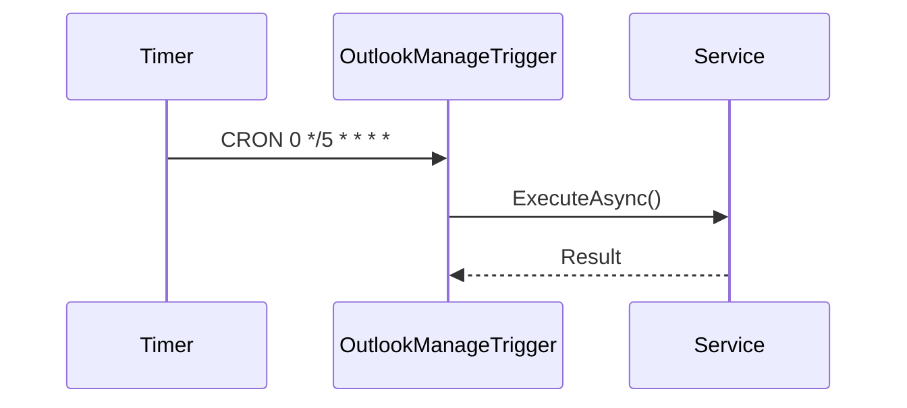

# OutlookManageTrigger

## Contesto

<!-- Descrivere il contesto di business della function -->

## Work Items

<!-- Elencare i work item Azure DevOps collegati (es. US, Task, Bug) -->

## Sequence Diagram

### Flusso

<!-- Inserire il sequence diagram Mermaid o un'immagine del flusso -->

## Trigger Configuration

| Proprietà   | Valore              |
|-------------|---------------------|
| Type        | TimerTrigger         |
| CRON        | `0 */5 * * * *`         |
| Run On Startup | false            |

## Scheduling

<!-- Descrivere la frequenza di esecuzione e il fuso orario di riferimento -->

| Proprietà   | Valore |
|-------------|--------|
| Frequenza   |        |
| Fuso orario |        |
| Finestra    |        |

## Logica di Esecuzione

<!-- Descrivere la logica eseguita ad ogni tick del timer -->

## Gestione Errori

<!-- Descrivere come vengono gestiti gli errori e le eventuali politiche di retry -->

## Wiki D365

<!-- Link alla wiki D365 e dettagli sull'integrazione con Dynamics 365 -->

## Dipendenze Esterne

<!-- Elencare i servizi esterni invocati dalla function -->

| Servizio | Descrizione | Endpoint |
|----------|-------------|----------|
|          |             |          |

## Allegati

<!-- Elencare eventuali allegati o documenti di riferimento -->

## Open Points

<!-- Elencare i punti aperti e le decisioni da prendere -->
