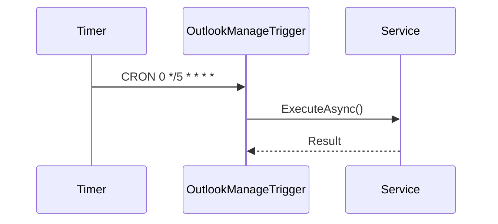

# OutlookManageTrigger

## Contesto

<!-- Descrivere il contesto di business della function -->

## Work Items

<!-- Elencare i work item Azure DevOps collegati (es. US, Task, Bug) -->

## Sequence Diagram

### Flusso

<!-- Inserire il sequence diagram Mermaid o un'immagine del flusso -->



## Trigger Configuration

| Proprietà   | Valore              |
|-------------|---------------------|
| Type        | TimerTrigger         |
| CRON        | `0 */5 * * * *`         |
| Run On Startup | false            |

## Scheduling

<!-- Descrivere la frequenza di esecuzione e il fuso orario di riferimento -->

| Proprietà   | Valore |
|-------------|--------|
| Frequenza   |        |
| Fuso orario |        |
| Finestra    |        |

## Logica di Esecuzione

<!-- Descrivere la logica eseguita ad ogni tick del timer -->

## Gestione Errori

<!-- Descrivere come vengono gestiti gli errori e le eventuali politiche di retry -->

## Wiki D365

<!-- Link alla wiki D365 e dettagli sull'integrazione con Dynamics 365 -->

## Dipendenze Esterne

<!-- Elencare i servizi esterni invocati dalla function -->

| Servizio | Descrizione | Endpoint |
|----------|-------------|----------|
|          |             |          |

## Allegati

<!-- Elencare eventuali allegati o documenti di riferimento -->

## Open Points

<!-- Elencare i punti aperti e le decisioni da prendere -->


## run on VS Code

Prerequisiti: `node` (per `npx`) o `docker`, Azure Functions Core Tools, .NET SDK.

1) Installare / avviare Azurite (emulatore Storage)

- Con npm (globale):
```powershell
npm install -g azurite
azurite --silent --location .\azurite --debug .\azurite\debug.log
```
- Con npx (senza installare):
```powershell
npx azurite --silent --location .\azurite --debug .\azurite\debug.log
```
- Con Docker:
```powershell
docker run -p 10000:10000 -p 10001:10001 -p 10002:10002 mcr.microsoft.com/azure-storage/azurite
```

2) Compilare il progetto (cartella con `host.json`):
```powershell
cd "C:\Users\d.buzzerio\POCoutlookManageIdentity\POCoutlookManageIdentity"
dotnet build -c Debug
```

3) Avviare l'host Functions in modalità verbose (mostra log runtime):
```powershell
func start --verbose
```

4) Debug in VS Code
- Impostare breakpoint in `OutlookManageTrigger.cs`.
- In Run and Debug selezionare ".NET: Attach to Process" e scegliere il processo `dotnet` corrispondente al worker (controllare la command line che include la DLL della function).

5) Note utili
- Se `local.settings.json` contiene `"AzureWebJobsStorage": "UseDevelopmentStorage=true"` è necessario che Azurite sia in esecuzione.
- Per test rapidi si può temporaneamente abilitare `RunOnStartup=true` nel `TimerTrigger` per forzare l'esecuzione all'avvio.
